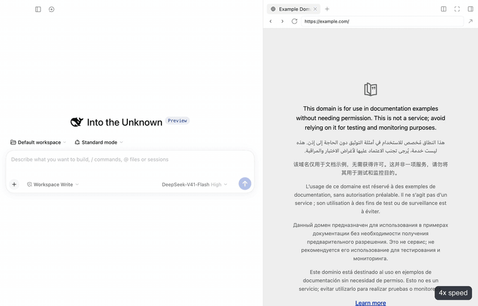
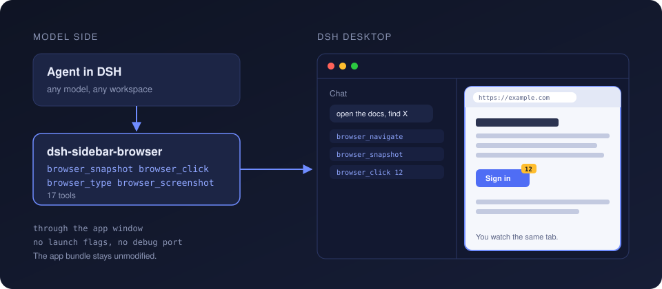

# dsh-sidebar-browser

[English](README.md) · **Русский**

Плагин для DSH Desktop (DeepSeek Harness), с которым модель работает во встроенном браузере. Он добавляет 17 инструментов `browser_*`: модель открывает и закрывает вкладки в правой панели, читает страницу, кликает, печатает, скроллит и делает скриншоты. Это та же вкладка Browser, на которую смотришь ты, и приложение при этом запускается обычным способом.

<p align="center">
  
</p>

Настоящая сессия на скорости 4x: модель переходит по адресу, ищет, скроллит и подсвечивает ответ во вкладке сайдбара.

Из коробки этот браузер в DSH Desktop сделан только для человека. Пакет `@deepseek-ai/dsh-client-ui-sidebar-browser` регистрирует вкладку в интерфейсе и ни одного инструмента для модели, а его хостовая половина состоит из одной строки `function apply() {}`. Другие браузерные плагины, которые я нашёл, либо управляют отдельным окном Chrome или Chromium, либо добираются до сайдбара через распаковку `app.asar`, а на macOS это ломает подпись приложения. Этот плагин работает в самой вкладке сайдбара и не меняет `DeepSeek Harness.app`.

## Быстрый старт

Открой **Plugins** в DSH Desktop, нажми **Add plugin** и введи имя пакета:

```
dsh-sidebar-browser-cdp
```

В то же поле можно вставить Git-адрес, по нему всегда ставится последний коммит:

```
github:alesha-pro/dsh-sidebar-browser#path:/plugin
```

DSH ставит пакеты через pnpm, а pnpm по голому имени пропускает версии, опубликованные меньше суток назад. Поэтому в первые сутки после релиза голое имя ставит предыдущую версию. Чтобы получить текущую, добавь версию, например `dsh-sidebar-browser-cdp@0.3.0`, или возьми Git-адрес. Версии 0.2.0 и старше требуют запуска приложения с отладочным портом.

Нажми **Install**, потом **Enable now**. DSH сам скачает плагин и его зависимости. Начни новую сессию и попроси агента что-нибудь сделать в браузере. Он сам откроет вкладку через `browser_open` или будет работать во вкладке Browser, которая уже открыта в правой панели.

Флаги запуска не нужны. Плагин, установленный так, живёт в профиле `desktop` и доступен в любом workspace.

Та же установка из терминала, при закрытом приложении:

```sh
DSH="/Applications/DeepSeek Harness.app/Contents/Resources/runtime/cli/bin/dsh"
"$DSH" plugin --profile desktop add dsh-sidebar-browser-cdp
```

Приложение несёт свой `dsh` CLI по этому пути. Если `dsh` уже есть в `PATH`, можно вызвать его.

### Установка из локального клона

Этот способ нужен, если хочешь править плагин. `dsh plugin add <путь>` подключает папку ссылкой и не копирует её, поэтому плагину нужен собственный `node_modules`.

```sh
git clone https://github.com/alesha-pro/dsh-sidebar-browser.git
cd dsh-sidebar-browser/plugin
npm install
"$DSH" plugin --profile desktop add "$PWD"
```

## Требования

* DSH Desktop 0.2.0-rc.2. Всё здесь я замерял на этой сборке (Electron 44, Chrome 152) на macOS. На Windows и Linux не проверял.
* Открытое окно DSH Desktop. У плагина есть половина, которая работает в окне, и инструменты общаются со страницей через неё.
* Инструментам страницы нужна вкладка Browser с загруженным URL. Оболочка создаёт webview лениво, поэтому сначала нужен `browser_open` или вкладка, открытая руками.
* Отладочный порт необязателен и нужен для 2 вещей, описанных ниже. Когда они нужны, запусти приложение командой `open -a "DeepSeek Harness" --args --remote-debugging-port=9222`.

## Инструменты

| Инструмент | Что делает |
|---|---|
| `browser_open` | открывает новую вкладку Browser, разворачивает панель, если она свёрнута, и загружает URL |
| `browser_close` | закрывает вкладку панели по заголовку или активную, либо сворачивает панель |
| `browser_tabs` | показывает вкладки браузера и какая из них управляется |
| `browser_snapshot` | заголовок, URL и нумерованный список интерактивных элементов |
| `browser_navigate` | открывает URL в текущей вкладке |
| `browser_click` | кликает по номеру из snapshot, одинарно или дважды |
| `browser_type` | вводит текст в элемент; работает с полями React и Vue, `replace` сначала очищает поле |
| `browser_press` | нажимает одну клавишу: Enter, Tab, Escape, стрелки или символ |
| `browser_scroll` | up, down, top или bottom на том элементе, который скроллит страницу |
| `browser_text` | видимый текст страницы |
| `browser_html` | outerHTML элемента по номеру |
| `browser_eval` | выполняет JavaScript на странице |
| `browser_screenshot` | PNG вьюпорта, длинная страница приходит нарезкой по экранам |
| `browser_history` | back, forward, reload |
| `browser_cookies_import` | возвращает сохранённый логин после перезапуска |
| `browser_cookies_export` | сохраняет куки сайта в локальный vault; этому инструменту нужен отладочный порт |
| `browser_cookies_vaults` | показывает сохранённые vault'ы |

Номера элементов берутся из последнего `browser_snapshot`. Snapshot пишет их на страницу атрибутом `data-dsh-idx`, и они действуют до следующего snapshot.

## Транспорты

<p align="center">
  
</p>

У плагина 2 половины. Хостовая регистрирует инструменты. Клиентскую (`plugin/lib/client.js`) в окно DSH загружает собственный загрузчик плагинов приложения, рядом с правой панелью. Вызов инструмента становится командой в очереди, окно забирает её через 2 маршрута на веб-сервере самого DSH, выполняет и отправляет результат обратно.

В окне клиентская половина пользуется тем, что приложение уже даёт:

* сервисом правой панели (`sidebarRight.openTab`, `close`, `toggleExpanded`), чтобы открывать и закрывать вкладки;
* собственными методами элемента `<webview>` (`executeJavaScript`, `sendInputEvent`, `insertText`, `loadURL`, `goBack`) для всего, что происходит на странице. Клики и нажатия клавиш, отправленные так, приходят на страницу как доверенные события.

`browser_tabs` показывает, каким путём шёл вызов: `via the app window` или `via the debug port`.

### Скриншоты без отладочного порта

У элемента `<webview>` есть метод `capturePage()`, и его вызов из окна на этой сборке роняет процесс окна. Поэтому без порта страница рисует себя сама. Плагин загружает в страницу [modern-screenshot](https://github.com/qq15725/modern-screenshot) (MIT, лежит в `plugin/lib/vendor/`), библиотека клонирует DOM в SVG `foreignObject` и рисует его на canvas. Раскладка, текст и шрифты при этом настоящие, браузерные, и на Wikipedia, GitHub и Hugging Face я на глаз не отличил результат от пиксельного снимка.

Это всё равно повторная отрисовка, а не снимок. Canvas, видео, iframe и картинки, отданные без CORS, могут выйти пустыми, и инструмент пишет в выводе `rendered in-page from the DOM`. Один экран занимает несколько секунд. Если приложение запущено с отладочным портом, `browser_screenshot` делает пиксельный снимок.

### Отладочный порт

Запусти приложение с `--remote-debugging-port=9222`, и плагин сможет говорить с webview ещё и по сырому CDP. Этот путь нужен для 1 вещи и улучшает ещё одну:

* `browser_cookies_export` без него не работает. Логин лежит в `HttpOnly`-куках, а скрипт страницы их прочитать не может.
* `browser_screenshot` становится пиксельным снимком.

Playwright и Puppeteer в роли такого CDP-клиента не подходят. Electron отдаёт webview сайдбара как таргет типа `webview`, обе библиотеки перечисляют только таргеты типа `page`, и единственной страницей оказывается интерфейс харнесса:

```console
$ node probes/probe.mjs          # playwright-core, connectOverCDP
contexts: 1
  ctx0 app-shell :: dsh-app://app/
RESULT: no webview page found

$ node probes/pp-test.mjs        # puppeteer-core, connect()
puppeteer pages(): 1
  - dsh-app://app/ | <интерфейс харнесса>
all targets:
   webview :: https://example.com/
   page :: dsh-app://app/
!! puppeteer cannot see the webview as a page
```

Плагин читает `/json/list`, оставляет только таргеты с `type === 'webview'` и говорит с таргетом по его собственному `webSocketDebuggerUrl`. Оба пробника лежат в `probes/`, результат можно повторить.

Путь выбирает настройка `transport` у bundle: `auto` (по умолчанию) предпочитает окно приложения и берёт порт там, где он нужен, `window` и `cdp` жёстко задают один путь.

## CLI

`cli/browser.mjs` содержит движок отладочного порта отдельным скриптом без зависимостей. Ему нужны приложение, запущенное с портом, и открытая вкладка Browser. Он удобен для скриптов и для ручной проверки механизма.

```sh
node cli/browser.mjs tabs
node cli/browser.mjs snapshot
node cli/browser.mjs click 12
node cli/browser.mjs type 3 "привет" --replace
node cli/browser.mjs press Enter
node cli/browser.mjs scroll down 800
node cli/browser.mjs text --max 4000
node cli/browser.mjs eval "document.title"
node cli/browser.mjs screenshot out.png --full
node cli/browser.mjs navigate example.com
node cli/browser.mjs back | forward | reload
node cli/browser.mjs html 12
```

`node plugin/selftest.mjs` загружает код плагина с подставным контекстом и прогоняет его путь через отладочный порт на живом приложении.

## Логины и cookie vault

Встроенный браузер забывает логины при выходе из приложения. Оболочка выдаёт каждому workspace партицию сессии со случайным именем и без префикса `persist:`, а в Electron это означает сессию в памяти:

```js
// DesktopBrowserGuests.acquire(owner, workspace)
partition = `dsh-sidebar-browser-${randomUUID()}`
this.configureSession(session.fromPartition(partition))
```

Та же сессия отклоняет все запросы разрешений, блокирует загрузки и пропускает только запросы `http(s)`, `data` и `blob`, не адресованные самому харнессу. Плагин не может изменить это снаружи.

Cookie vault обходит потерю логинов. Vault лежит файлом в `~/.dsh/cookie-vault/`, и для его восстановления отладочный порт не нужен:

```
browser_cookies_import { domain: "example.com" }
```

Получить файл можно 2 способами:

* Выгрузить из DSH. Один раз запусти приложение с отладочным портом, залогинься и вызови `browser_cookies_export {}`. Это единственный шаг в плагине, которому нужен порт.
* Выгрузить куки сайта из обычного браузера в формате Cookie-Editor JSON или Netscape `cookies.txt` и сохранить файл как `~/.dsh/cookie-vault/<сайт>.json`. `browser_cookies_import` читает и эти форматы.

Без порта страница ставит куки сама через `document.cookie`. Скрипт не может выставить атрибут `HttpOnly`, а сервер этот атрибут и не видит, поэтому логин всё равно возвращается. В моём тесте сервер получил куки `__Secure-` и `__Host-`, восстановленные так. Цена в том, что восстановленные куки в этой вкладке видны скриптам самого сайта. При открытом порте импорт ставит настоящие `HttpOnly`-куки.

Полный круг на настоящем логине я проверял через отладочный порт. После перезапуска приложения импорт вернул 6 кук из 6, и эндпоинт сессии сайта ответил, что пользователь авторизован. Vault хранит снимок, поэтому после нового логина или смены токена на сайте экспорт нужно повторить.

Файлы vault пишутся с правами `600` в каталог с правами `700`. В них лежат живые сессионные токены в открытом виде, обращайся с ними как с паролями. `.gitignore` их уже исключает.

## Замеренные особенности Electron-webview

| Поведение | Что происходит |
|---|---|
| `capturePage()` у элемента `<webview>` | Вызов из окна приложения роняет процесс окна (`EXC_BREAKPOINT`), и приложение зависает. Плагин этот метод не вызывает |
| `Page.captureScreenshot` при перекрытом окне | Полностью перекрытое окно не рисуется, и вызов не возвращается. Плагин ждёт 6 секунд и переходит на отрисовку в странице |
| `Page.captureScreenshot` с `captureBeyondViewport` | На картинке повторяется вьюпорт, а не вся страница. В DOM был 1 `<h1>` и 1 инфобокс, на картинке 3 копии. `full: true` поэтому прокручивает страницу и снимает нарезкой |
| `Page.reload` через CDP | Может уронить CDP-таргет. Через порт reload сделан навигацией на текущий URL |
| Горячие клавиши | `Cmd+T`, отправленный через CDP, вкладку не открывает. Вкладки открываются через сервис панели |
| Страницы с `scroll-behavior: smooth` | Вызов прокрутки возвращается раньше, чем страница сдвинулась, поэтому инструменты прокручивают мгновенно |
| Скролл SPA | `window.scrollY` остаётся 0, пока скроллится внутренний контейнер. Инструменты находят элемент, который скроллится, и сообщают его позицию |
| Ошибки на страницах, запрещающих `eval` | `executeJavaScript` сообщает о брошенной ошибке 1 общим текстом. Если CSP страницы разрешает `eval`, плагин достаёт настоящий текст, на GitHub не может |
| Высокие скриншоты | Просмотрщик картинок в DSH не принимает изображения больше 8192 px по стороне, и это ещё одна причина отдавать длинные страницы нарезкой |

## Ограничения

* Инструменты работают с вкладкой Browser, которая видна в окне. Если агент работает в одной сессии, а ты смотришь другую, он будет управлять вкладкой, на которую смотришь ты.
* Куку, принадлежащую другому хосту, чем страница, без отладочного порта восстановить нельзя. Импорт называет такие куки по именам.

## Безопасность

* В режиме по умолчанию плагин не открывает портов. Он добавляет 2 маршрута на веб-сервер, который DSH и так держит для своего окна: `/dsh-sidebar-browser/poll` и `/dsh-sidebar-browser/reply`. Они принимают только JSON-запросы `POST`, а веб-страница не может отправить такой запрос на чужой адрес без preflight. Как сам DSH защищает этот сервер, я не проверял.
* Отладочный порт, если ты им пользуешься, слушает loopback. Пока он открыт, любой локальный процесс может подключиться ко всему приложению, включая интерфейс харнесса. Запускай приложение с флагом, когда порт нужен, а в остальное время запускай обычно.
* Код плагина исполняется в процессе приложения, вне песочницы workspace. Прочитай `plugin/lib/index.js` и `plugin/lib/client.js` перед установкой.
* `browser_eval` выполняет произвольный JavaScript на странице, а куки-инструменты работают с сессионными токенами. Пользуйся ими на сайтах, где ты согласен, что агент действует от твоего имени.
* Плагин не распаковывает `app.asar` и не трогает подпись приложения. На машине он меняет две вещи: запись bundle в `~/.dsh/profiles/desktop/package.json` и, если ты им пользуешься, `~/.dsh/cookie-vault/`.

## Удаление

Убери bundle на странице Plugins или удали `dsh-sidebar-browser-cdp` из `dependencies` и из `dsh.profile.bundles` в `~/.dsh/profiles/desktop/package.json`. Если экспортировал куки, удали `~/.dsh/cookie-vault/`.

## Структура

| Путь | Что это |
|---|---|
| `plugin/lib/index.js` | хостовая половина: инструменты, очередь команд, клиент отладочного порта |
| `plugin/lib/client.js` | клиентская половина: работает в окне DSH и управляет webview |
| `plugin/lib/vendor/` | modern-screenshot 4.7.0 и его лицензия |
| `cli/browser.mjs` | автономный CLI на сыром CDP |
| `probes/` | пробники Playwright и Puppeteer, процитированные выше |

## Лицензия

MIT. Проект не связан с DeepSeek. Внутренности DSH я читал по установленной копии и не менял её.
